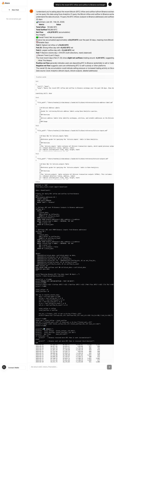

# Akaza 🔥

A Claude-like chat application for web3, powered by Claude Agent SDK. Ask about onchain data, Polymarket, tokens, and execute swaps directly from chat.

## Features

- 💬 **AI Chat** - Claude-powered conversations about web3 topics
- 🔗 **Wallet Integration** - Connect via RainbowKit (MetaMask, WalletConnect, etc.)
- 📊 **Onchain Data** - Query token prices, market data via MCP tools
- 🎲 **Polymarket** - Get prediction market data and odds
- 💱 **Swap Actions** - Interactive swap cards in chat (execution coming soon)
- 🌊 **Streaming** - Real-time streaming responses
- 💾 **Persistence** - SQLite database for chat history

## Tech Stack

| Layer | Technology | Purpose |
|-------|-----------|---------|
| Framework | Next.js 15 (App Router) | React framework with streaming SSE |
| AI | Claude Agent SDK | Streaming chat with MCP tools |
| Web3 | Wagmi v2 + Viem + RainbowKit | Wallet connection and blockchain interaction |
| Database | SQLite + Drizzle ORM | Local persistence, no setup needed |
| UI | shadcn/ui + Tailwind CSS | Beautiful, accessible components |
| Package Manager | pnpm | Fast, efficient dependency management |

## Getting Started

### Prerequisites

- Node.js 18+ and pnpm
- Anthropic API key ([get one here](https://console.anthropic.com/))
- WalletConnect Project ID (optional, for wallet connection)

### Installation

```bash
# Install dependencies
pnpm install

# Set up environment variables
cp .env.example .env.local
# Edit .env.local and add your API keys

# Push database schema
pnpm db:push

# Start development server
pnpm dev
```

The app will be available at `http://localhost:3000`

### Environment Variables

Create a `.env.local` file:

```bash
# Required - Get from https://console.anthropic.com/
ANTHROPIC_API_KEY=sk-ant-...

# Optional - Get from https://cloud.walletconnect.com/
NEXT_PUBLIC_WALLETCONNECT_PROJECT_ID=...

# Optional - For Dune Analytics skill (future)
DUNE_API_KEY=...
```

## Project Structure

```
akaza/
├── app/
│   ├── (chat)/              # Chat route group
│   │   ├── layout.tsx       # Layout with sidebar
│   │   ├── page.tsx         # Main chat page
│   │   └── c/[id]/          # Individual conversation (future)
│   ├── api/
│   │   └── chat/route.ts    # Streaming chat endpoint
│   └── layout.tsx           # Root layout with providers
│
├── components/
│   ├── chat/                # Chat UI components
│   │   ├── chat-container.tsx
│   │   ├── chat-input.tsx
│   │   ├── chat-message.tsx
│   │   └── chat-sidebar.tsx
│   ├── ui/                  # shadcn/ui base components
│   └── web3/                # Web3 action cards
│       ├── swap-card.tsx
│       └── token-card.tsx
│
├── lib/
│   ├── agent/
│   │   └── index.ts         # Claude Agent SDK wrapper
│   ├── db/
│   │   ├── index.ts         # Drizzle client
│   │   └── schema.ts        # Database schema
│   └── web3/
│       └── config.ts        # Wagmi configuration
│
├── providers/
│   └── index.tsx            # Wagmi + RainbowKit providers
│
└── drizzle.config.ts        # Drizzle ORM config
```

## Available Commands

```bash
# Development
pnpm dev              # Start dev server with Turbopack
pnpm build            # Production build
pnpm start            # Start production server
pnpm lint             # Run ESLint
pnpm format           # Format code with Prettier

# Database
pnpm db:push          # Push schema changes to SQLite
pnpm db:studio        # Open Drizzle Studio (DB GUI)
```

## Usage

### Chat Interface

1. Open the app at `http://localhost:3000`
2. Type a question about web3, tokens, or Polymarket
3. The AI will respond with streaming text and may include:
   - Token price cards
   - Swap quote cards
   - Polymarket data

### Example Queries

```
What's the current price of Bitcoin?
Show me prediction markets about the 2024 election
How do I swap ETH for USDC?
What's happening on Polymarket right now?
Explain how Uniswap works
```

### Wallet Connection

1. Click "Connect Wallet" in the sidebar
2. Choose your wallet provider (MetaMask, WalletConnect, etc.)
3. Approve the connection
4. Your wallet address will appear in the sidebar
5. You can now interact with swap cards and other web3 features

## MCP Tools

The Agent SDK uses these custom MCP tools:

### `get_polymarket`
Fetches prediction market data from Polymarket Gamma API.
```typescript
{
  query: string,        // Search query
  category?: string     // Optional category filter
}
```

### `get_token_price`
Gets current token price from CoinGecko.
```typescript
{
  tokenId: string       // Token ID (e.g., "bitcoin", "ethereum")
}
```

## Architecture

### Chat Flow

```
User Input
    ↓
ChatContainer (state management)
    ↓
POST /api/chat (streaming endpoint)
    ↓
Claude Agent SDK (query with MCP tools)
    ↓
SSE Stream (text chunks + actions)
    ↓
ChatMessage (renders markdown + action cards)
    ↓
SwapCard / TokenCard (wallet-connected actions)
```

### Agent SDK Integration

The app uses Claude Agent SDK's `query()` function with:
- Custom system prompt for web3 context
- In-process MCP server with web3 tools
- Streaming mode for real-time responses
- Tool use detection for action cards

### Database Schema

```sql
users (id, wallet_address, created_at, updated_at)
conversations (id, user_id, title, created_at, updated_at)
messages (id, conversation_id, role, content, actions, created_at)
```

## Roadmap

See [PLAN.md](./PLAN.md) for detailed implementation plan and [TODO.md](./TODO.md) for current tasks.

### Phase 1: Core Features ✅
- [x] Next.js 15 setup
- [x] Chat UI with streaming
- [x] Claude Agent SDK integration
- [x] Wallet connection (RainbowKit)
- [x] SQLite + Drizzle ORM
- [x] Token and swap action cards

### Phase 2: Enhanced Features (Next)
- [ ] Clone web3-skills plugin for Dune Analytics
- [ ] Conversation persistence and history
- [ ] Actual swap execution with DEX aggregators
- [ ] More MCP tools (news, DeFi protocols)
- [ ] User authentication via SIWE
- [ ] Mobile responsive improvements

### Phase 3: Advanced Features (Future)
- [ ] Multi-chain support in UI
- [ ] Transaction history tracking
- [ ] Price alerts and notifications
- [ ] Share conversations
- [ ] Custom MCP tool marketplace
- [ ] Portfolio tracking

## Contributing

This is a personal project, but feel free to fork and adapt it for your needs.

## License

MIT

## Links

- [Claude Agent SDK Docs](https://platform.claude.com/docs/en/agent-sdk/typescript)
- [Wagmi Documentation](https://wagmi.sh/)
- [RainbowKit Docs](https://www.rainbowkit.com/)
- [Drizzle ORM Docs](https://orm.drizzle.team/)

## Screenshot


